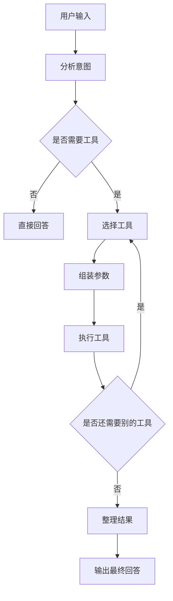

# Day 14 - 项目 1：工具调用 Agent

> 目标：做出一个“会自己选工具”的 AI Agent。
>
> 本 Day 的核心不是继续背概念，而是把 Day 6 的 Function Calling、Day 10 的 Tools、Day 11 的 Agent 选择逻辑，真正串成一个可以运行的小项目。

---

## 0. 项目文件

本目录会生成成套代码，结构尽量和前面的 `day13` 保持一致：

```text
day14/
├── 01_tool_basics.py
├── 02_custom_tools.py
├── 03_function_calling.py
├── 04_tool_agent.py
├── 05_chat_interface.py
├── config.py
├── main.py
├── requirements.txt
├── README.md
└── modules/
    ├── __init__.py
    ├── agent.py
    └── tools.py
```

如果你想直接运行：

```bash
python main.py
```

## 1. 本日任务目标

Day 14 的任务很明确：**实现一个可调用多个工具的 Agent**。

这个 Agent 需要具备下面这些能力：

1. 能理解用户的意图。
2. 能从多个工具中选择最合适的工具。
3. 能在必要时连续调用多个工具。
4. 能把工具返回的结果整理成自然语言答案。
5. 能处理工具报错、参数缺失、无法识别意图等异常情况。

从图片里的课程安排来看，Day 14 属于第 2 周的第一个项目，重点是把前面学到的：

- `Function Calling`
- `Tools`
- `Agent`

组合成一个**真正可用的工具调用 Agent**。

---

## 2. 这个项目要解决什么问题

很多 AI 应用并不是“只聊天”这么简单，它们往往需要：

- 查天气
- 算数学题
- 做单位换算
- 翻译文本
- 查时间
- 读本地资料

如果只靠大模型自己生成答案，它可能：

- 算错
- 胡编
- 不知道最新信息
- 对结构化任务不稳定

所以我们要做一个 Agent，让它在遇到合适的请求时，**主动调用外部工具**，而不是闭着眼睛瞎猜。

这就是 Day 14 的核心价值。

---

## 3. 本项目的最终产物

完成 Day 14 后，你应该得到一个最小可运行的工具调用 Agent，建议至少包含以下能力：

### 3.1 必做能力

- 一个主对话入口
- 至少 3 个工具
- 能自动选择工具
- 能输出最终自然语言结果

### 3.2 推荐工具

图片里的项目建议里提到的方向是：

- 天气查询
- 计算器
- 翻译

你也可以再补一个：

- 当前时间查询

### 3.3 最终效果示例

用户输入：

```text
帮我查一下北京今天的天气，再把 25 摄氏度换成华氏度
```

Agent 行为：

1. 判断这是一个需要工具的请求。
2. 先调用天气工具。
3. 再调用单位换算工具。
4. 把两个结果整理成一句完整回答。

最终输出示例：

```text
北京今天天气晴，气温 25°C。换算成华氏度约为 77°F。
```

---

## 4. 建议的文件结构

如果你想把 Day 14 做成一个完整的小项目，建议在 `day14` 文件夹下按下面方式组织：

```text
day14/
├── README.md
├── main.py
├── tools.py
├── agent.py
├── config.py
└── .env
```

### 4.1 每个文件的职责

#### `README.md`

用来说明这个项目做什么、怎么做、如何运行、有哪些任务点。

#### `main.py`

程序入口，负责启动对话流程。

#### `tools.py`

放所有工具函数，比如天气、计算器、翻译、时间等。

#### `agent.py`

放 Agent 的核心逻辑，比如：

- 判断是否要调用工具
- 选择工具
- 执行工具
- 汇总结果

#### `config.py`

放 API Key、模型名、基础配置等内容。

#### `.env`

放敏感信息，不要直接写进代码里。

---

## 5. 本项目的知识点拆解

Day 14 看起来像“做项目”，实际上要用到很多前面学过的能力。

### 5.1 Function Calling

Function Calling 的本质是：

- 你告诉模型有哪些工具
- 模型判断什么时候该用哪个工具
- 模型输出工具参数
- 你的程序真正执行工具
- 再把结果交回给模型生成自然语言回复

它的价值是：

- 让模型“会用工具”
- 降低胡说八道的概率
- 让 AI 能处理结构化任务

### 5.2 Tools

工具就是你给 Agent 提供的“外部能力”。

工具通常有三个部分：

- 工具名称
- 工具描述
- 工具参数

例如：

- `calculate(expression)`
- `get_weather(city)`
- `translate(text, target_language)`

### 5.3 Agent

Agent 是一个“会思考、会选工具、会执行”的控制器。

Agent 的关键不是生成答案本身，而是：

- 分析任务
- 选择步骤
- 调用工具
- 整理输出

简单说：

> 大模型负责“想”，工具负责“做”，Agent 负责“调度”。

---

## 6. 工具设计说明

这一部分是 Day 14 的核心。

你可以把工具分成以下几类：

### 6.1 计算器工具

用途：

- 做加减乘除
- 处理简单数学表达式
- 计算百分比、幂、括号表达式

示例：

```text
1 + 2 * (3 + 4)
```

返回：

```text
15
```

#### 设计建议

- 只接受字符串表达式
- 做安全校验，避免直接执行危险代码
- 尽量不要用 `eval()` 直接裸跑用户输入

---

### 6.2 天气查询工具

用途：

- 查询某个城市的天气
- 返回温度、天气描述、风速、湿度等信息

示例：

```text
北京天气怎么样？
```

返回：

```text
北京：晴，25°C，湿度 45%，微风
```

#### 设计建议

- 参数至少包含 `city`
- 如果你没有真实天气 API，可以先做一个模拟数据版本
- 如果后面接真实接口，注意处理网络异常和空值

---

### 6.3 翻译工具

用途：

- 中英互译
- 多语言转换

示例：

```text
把“我今天很开心”翻译成英文
```

返回：

```text
I am very happy today.
```

#### 设计建议

- 参数至少包含 `text` 和 `target_language`
- 结果要尽量自然，不要只做字面直译

---

### 6.4 时间工具

用途：

- 查询当前时间
- 获取日期
- 回答“现在几点了”

这个工具很适合用来测试 Agent 对“无需调用大模型也能直接回答的问题”的处理能力。

---

## 7. Agent 的工作流程

下面是一个推荐的工作流程。



### 7.1 意图分析

Agent 先判断用户要什么：

- 纯聊天
- 计算
- 查询
- 翻译
- 组合任务

### 7.2 工具选择

如果用户问的是：

- “2+3 等于多少” -> 计算器
- “上海今天天气” -> 天气工具
- “把这句话翻译成英文” -> 翻译工具

### 7.3 参数组装

Agent 需要把自然语言变成工具能懂的结构化参数。

例如：

```text
帮我查北京天气
```

可以提取出：

```json
{
  "city": "北京"
}
```

### 7.4 工具执行

真正执行工具的是你的程序，不是模型本身。

这一步会得到工具结果，比如：

```json
{
  "city": "北京",
  "weather": "晴",
  "temperature": 25
}
```

### 7.5 结果整理

Agent 最后要把工具结果整理成：

- 简洁
- 正确
- 好读
- 对用户友好

---

## 8. 推荐实现步骤

下面是一个很适合照着做的开发顺序。

### 第 1 步：先写工具函数

先不要急着写 Agent。

先把工具函数单独写好：

- `calculator()`
- `get_weather()`
- `translate()`
- `get_current_time()`

要求：

- 每个函数都先能独立运行
- 每个函数都能返回清晰结果

### 第 2 步：为工具定义结构

你需要把工具声明成模型可理解的格式。

通常包括：

- 工具名
- 工具说明
- 参数说明
- 参数类型

### 第 3 步：写工具分发器

工具分发器负责：

- 根据工具名找到对应函数
- 传入参数
- 拿回执行结果

### 第 4 步：写 Agent 主循环

主循环负责：

- 接收用户输入
- 请求模型判断是否调用工具
- 识别模型返回的工具请求
- 执行工具
- 再次把结果给模型

### 第 5 步：做异常处理

需要考虑：

- 参数缺失
- 工具名错误
- 工具执行失败
- 用户问题不适合工具调用

### 第 6 步：补测试案例

至少测试下面这些输入：

1. 纯计算
2. 纯翻译
3. 纯天气
4. 组合任务
5. 无法识别的任务

---

## 9. 任务清单

下面这一部分就是你可以直接照着完成的 Day 14 任务。

### 任务 1：实现计算器工具

要求：

- 支持基本四则运算
- 支持括号
- 能正确处理浮点数

验收标准：

- 输入 `2+3*4`，输出 `14`
- 输入 `(10-2)/4`，输出 `2`

---

### 任务 2：实现天气工具

要求：

- 输入城市名
- 返回天气描述
- 返回温度信息

验收标准：

- 输入 `北京`
- 能返回一条结构清晰的天气结果

如果你没有天气接口，可以先写一个模拟版本，后面再替换成真实接口。

---

### 任务 3：实现翻译工具

要求：

- 支持文本翻译
- 支持目标语言参数

验收标准：

- 输入中文，输出英文
- 输入英文，输出中文

---

### 任务 4：定义工具 schema

要求：

- 每个工具都要有明确的名称
- 每个工具都要有参数说明
- 每个参数都要有类型和描述

验收标准：

- 模型能根据 schema 正确知道工具能做什么

---

### 任务 5：实现 Agent 调度逻辑

要求：

- 能自动选择工具
- 能执行工具
- 能把结果回传给模型

验收标准：

- 用户说“帮我算一下”时会调用计算器
- 用户说“北京天气”时会调用天气工具
- 用户说“翻译成英文”时会调用翻译工具

---

### 任务 6：实现多工具组合

要求：

- 一个用户请求中，可能需要多个工具
- Agent 能按顺序调用多个工具

示例：

```text
帮我查北京天气，然后把 25 摄氏度换成华氏度
```

这类任务可能先调用天气工具，再调用计算器或单位换算工具。

---

### 任务 7：实现错误处理

要求：

- 工具调用失败时给出清晰提示
- 参数不完整时尝试追问
- 工具无法满足需求时给出降级答案

验收标准：

- 程序不会因为一个错误直接崩掉

---

### 任务 8：完善最终输出

要求：

- 答案要自然
- 答案要简洁
- 答案要包含工具结果

验收标准：

- 用户看起来像在和一个真正“会做事”的助手对话

---

## 10. 你可以直接参考的接口设计思路

下面不是必须照抄的代码，而是一个推荐思路。

### 10.1 工具函数接口

```python
def calculator(expression: str) -> str:
    """执行数学表达式计算。"""

def get_weather(city: str) -> str:
    """查询城市天气。"""

def translate(text: str, target_language: str) -> str:
    """翻译文本到目标语言。"""
```

### 10.2 Agent 处理接口

```python
def run_agent(user_input: str) -> str:
    """接收用户输入，自动决定是否调用工具，并返回最终回复。"""
```

### 10.3 工具分发接口

```python
def dispatch_tool(tool_name: str, arguments: dict) -> str:
    """根据工具名调用对应函数。"""
```

---

## 11. 常见问题

### 11.1 为什么模型不会自动真的去执行工具？

因为模型只负责“生成工具请求”，真正执行工具的是你写的程序。

这就是 Function Calling 的核心设计。

---

### 11.2 为什么工具一定要结构化？

因为模型只有在知道：

- 工具名称
- 参数字段
- 字段含义

之后，才更容易稳定地产生正确调用。

---

### 11.3 为什么不能直接把用户输入交给 `eval()`？

因为那样有安全风险。

比如用户输入恶意表达式，可能会执行不安全代码。

所以：

- 计算器要做输入校验
- 尽量只允许安全表达式
- 如果可以，使用专门的表达式解析库

---

### 11.4 天气接口如果没有真实 API 怎么办？

可以先做一个“假数据版”：

- 给几个常见城市写静态返回值
- 先把 Agent 流程跑通
- 后面再替换成真实天气服务

这在学习项目里是非常常见的做法。

---

## 12. 学习重点

Day 14 不是只练代码，而是要学会下面这些思维：

### 12.1 把任务拆成“模型负责”和“工具负责”

模型擅长：

- 理解自然语言
- 判断意图
- 组织答案

工具擅长：

- 计算
- 查询
- 翻译
- 调用外部能力

### 12.2 把自然语言转成结构化参数

这一步是 Agent 的灵魂。

例如：

```text
帮我把 36 摄氏度换算成华氏度
```

拆成：

```json
{
  "value": 36,
  "from_unit": "celsius",
  "to_unit": "fahrenheit"
}
```

### 12.3 工具调用后要会“总结”

工具返回的往往不是最终用户最想看的表达方式。

Agent 要把它变得更自然、更易懂。

---

## 13. 验收标准

如果你想知道 Day 14 是否做完了，可以用下面标准检查。

### 13.1 功能验收

- 能识别至少 3 种工具场景
- 能正确调用对应工具
- 能连续调用多个工具
- 能输出自然语言答案

### 13.2 工程验收

- 文件结构清晰
- 工具逻辑和 Agent 逻辑分离
- 配置和代码分离
- 错误处理完整

### 13.3 体验验收

- 用户输入后，Agent 能稳定响应
- 不会频繁胡乱调用工具
- 回答结果清楚、简洁、可读

---

## 14. 推荐练习题

如果你想把 Day 14 做扎实，可以再做这些扩展：

### 练习 1：增加单位换算工具

支持：

- 摄氏度转华氏度
- 千米转英里
- 公斤转磅

### 练习 2：增加时间工具

支持：

- 查询当前本地时间
- 查询某时区时间

### 练习 3：增加搜索工具

支持：

- 关键词搜索
- 返回搜索摘要

### 练习 4：让 Agent 支持多轮追问

如果用户参数不完整，Agent 需要问清楚再执行。

例如：

```text
帮我查天气
```

可以追问：

```text
你想查哪个城市的天气？
```

---

## 15. 学完 Day 14 之后你应该具备什么

完成这个项目后，你应该真正掌握：

- 如何定义工具
- 如何让模型选择工具
- 如何把模型输出转成程序调用
- 如何把工具结果再喂回模型
- 如何让 Agent 从“聊天”升级成“能干活”

这一步非常关键。

因为从 Day 14 开始，你做的就不只是聊天机器人了，而是更接近真实产品里的 **AI 助手 / AI Agent**。

---

## 16. 建议的学习节奏

如果你今天只想高效完成 Day 14，可以按这个顺序来：

1. 先理解工具调用的工作流。
2. 先写 3 个最小工具。
3. 再写工具分发器。
4. 再接模型判断逻辑。
5. 最后加错误处理和多工具串联。

---

## 17. 最后总结

Day 14 的本质，是把前面学到的知识真正落到一个可运行项目里。

你最终要做的是：

- 一个懂意图的 Agent
- 一个会选工具的 Agent
- 一个能调用多个工具的 Agent
- 一个能把结果说清楚的 Agent

如果你把这一页的内容完整做下来，Day 14 就不只是“完成任务”，而是在给后面的 RAG 项目、Coding Agent、工程化部署打基础。
